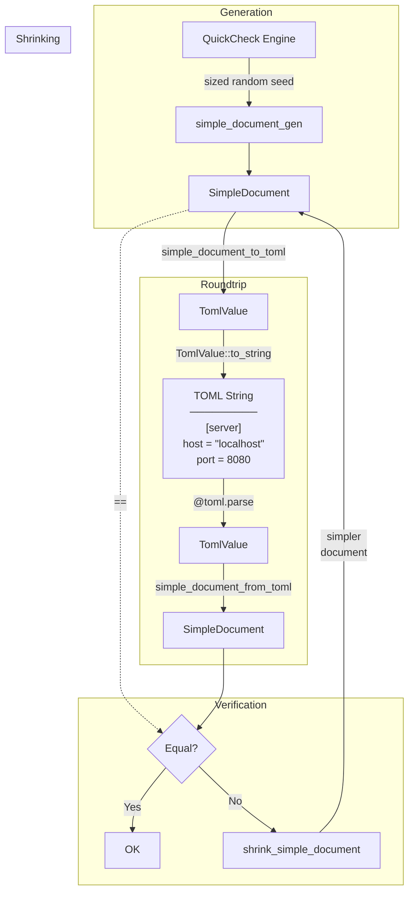
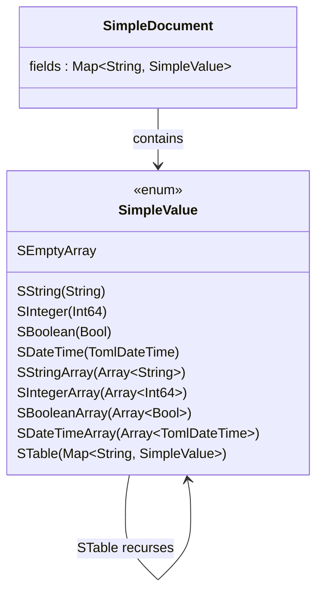
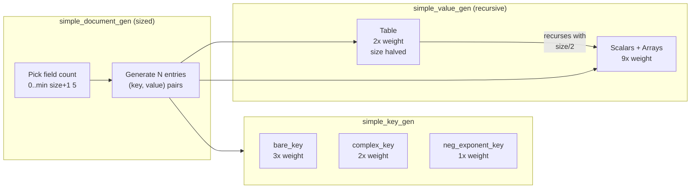
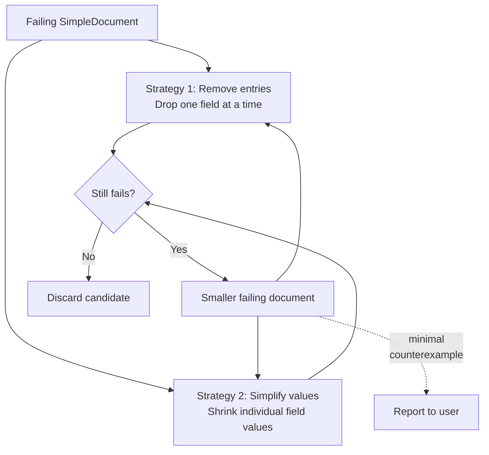

# Property-Based Testing with `qc_model`

This module implements **property-based (QuickCheck-style) fuzzing** for the TOML parser.
The core idea: generate random TOML documents, serialize them to strings, parse them back,
and verify the result matches the original.

## Architecture Overview



## The SimpleDocument Model

`SimpleDocument` is a **deliberately simplified subset** of the full TOML value space.
It omits floats and mixed-type arrays to avoid representation ambiguities that would
cause false roundtrip failures. This makes equality comparison reliable after a roundtrip.



## How Generation Works

Generators are **size-driven** and **frequency-weighted** to produce realistic documents
while keeping generation bounded.



Key generation strategies:

| Generator | Example output | Purpose |
|---|---|---|
| `bare_key_gen` | `host`, `a-b`, `x_1` | Common alphanumeric keys |
| `complex_key_gen` | `"key with spaces"`, `"key.dot"` | Keys requiring quoting |
| `negative_exponent_like_key_gen` | `-1e-5`, `-42E3` | Edge case: keys that look like floats |

The **size parameter** (max 12) controls both nesting depth and collection lengths.
`capped_size` ensures arrays stay at most 4-5 elements and tables at most 4 fields,
preventing combinatorial explosion while still exploring interesting structures.

## The Roundtrip Pipeline

Each generated `SimpleDocument` passes through this pipeline:

```mermaid
sequenceDiagram
    participant QC as QuickCheck
    participant Gen as Generator
    participant Conv as Converter
    participant Ser as Serializer
    participant Par as Parser
    participant Chk as Checker

    QC->>Gen: generate(seed, size)
    Gen->>QC: SimpleDocument

    QC->>Conv: simple_document_to_toml(doc)
    Conv->>QC: TomlValue

    QC->>Ser: toml_value.to_string()
    Ser->>QC: TOML string

    QC->>Par: @toml.parse(string)
    Par->>QC: TomlValue

    QC->>Conv: simple_document_from_toml(parsed)
    Conv->>QC: SimpleDocument

    QC->>Chk: original == roundtripped?
    alt match
        Chk->>QC: pass
    else mismatch
        Chk->>QC: fail + counterexample
    end
```

The conversion functions (`simple_value_to_toml` / `simple_value_from_toml`) bridge
between the simplified model and the full `TomlValue` type. This two-level design
lets us generate values we *know* should roundtrip cleanly, without constraining the
parser's own type system.

## Shrinking

When a test fails, QuickCheck **shrinks** the failing document to find the smallest
reproduction. Shrinking applies two strategies iteratively:



- **Scalars** shrink via QuickCheck builtins (strings get shorter, integers approach 0)
- **Arrays** shrink by removing one element at a time
- **Tables** shrink by removing entries *or* shrinking individual values
- **DateTimes** are atomic and don't shrink

## Test Coverage Classification

The test classifies each passing case to verify the generator explores diverse structures:

```
+++ [2000/0/2000] Ok, passed!
44.4% : contains-string
52.55% : contains-complex-key
33.15% : contains-negative-exponent-like-key
36.7% : contains-datetime
22.05% : contains-fractional-datetime
21.05% : contains-datetime-array
61% : contains-array
29.15% : contains-table
```

This ensures we aren't just testing trivial documents -- a significant portion of test
cases exercise nested tables, datetime edge cases, special key formats, and arrays.

## File Overview

| File | Role |
|---|---|
| `model.mbt` | `SimpleDocument` / `SimpleValue` types and classification predicates |
| `gen_test.mbt` | QuickCheck generators for keys, values, and documents |
| `shrink_test.mbt` | Shrinking functions for minimal counterexample discovery |
| `roundtrip_test.mbt` | `SimpleValue` <-> `TomlValue` conversion and roundtrip property |
| `qc_model_test.mbt` | Test entry point -- runs 2000 roundtrips with shrinking |
