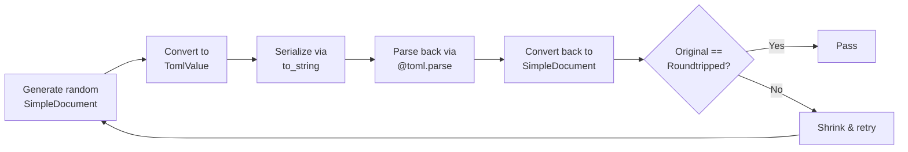
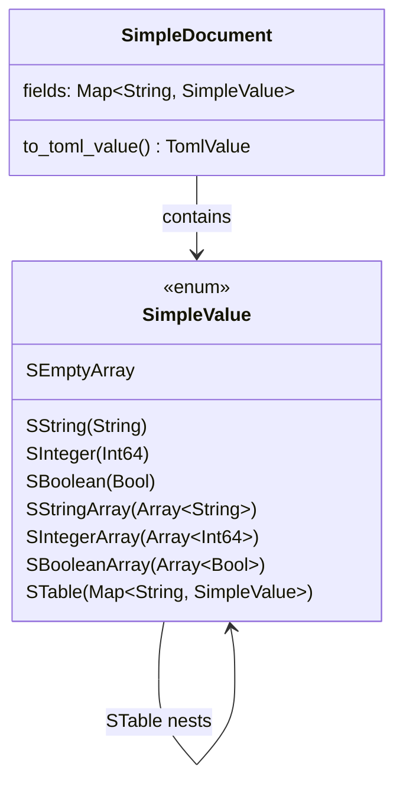
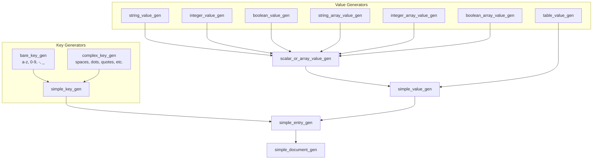

# QuickCheck Roundtrip Testing

This project uses [moonbitlang/quickcheck](https://mooncakes.io/docs/#/moonbitlang/quickcheck/) to verify that the TOML serializer produces output the parser can round-trip correctly.

## How It Works

The test generates random TOML documents, serializes them to strings, parses the strings back, and checks that the result matches the original.



## Architecture

The test uses a **simplified document model** (`SimpleDocument` / `SimpleValue`) rather than the full `TomlValue` type. This avoids generating values that are hard to round-trip (floats, datetimes) and focuses on the structural correctness of the serializer.



## QuickCheck Components

The test package now keeps the QuickCheck plumbing in test-only files:

- `internal/qc_model/gen_test.mbt` defines the generators.
- `internal/qc_model/shrink_test.mbt` defines the shrink helpers.
- `internal/qc_model/roundtrip_test.mbt` defines the TOML conversion and property.
- `internal/qc_model/qc_model_test.mbt` runs the property test.

These helpers are no longer exported from `internal/qc_model`; the package only
keeps the simplified model types used by the test.

The test implements four key pieces required by the quickcheck framework:

### 1. Generators (`@qc.Gen`)

Generators produce random values. Each type needs a custom generator.



Key generator patterns used:

| Pattern | Example | Purpose |
|---------|---------|---------|
| `@qc.Gen::spawn()` | `@qc.Gen[String]::spawn()` | Use the built-in Arbitrary instance |
| `@qc.one_of([...])` | `one_of([pure('-'), pure('_')])` | Choose uniformly from options |
| `@qc.frequency([...])` | `frequency([(3U, bare), (2U, complex)])` | Weighted random choice |
| `.fmap(fn)` | `gen.fmap(fn(x) { SString(x) })` | Transform generated values |
| `.bind(fn)` | `gen.bind(fn(n) { ... })` | Chain dependent generators |
| `@qc.liftA2(f, g1, g2)` | `liftA2(make_pair, key_gen, val_gen)` | Combine two generators |
| `.scale(fn)` | `gen.scale(fn(s) { min(s, 8) })` | Control size parameter |
| `.array_with_size(n)` | `gen.array_with_size(len)` | Generate fixed-size arrays |
| `@qc.sized(fn)` | `sized(fn(size) { ... })` | Access the current size |

### 2. Shrinker (`(@qc_model.SimpleValue) -> Iter[@qc_model.SimpleValue]`)

When a test fails, quickcheck uses shrinkers to find the **minimal** failing case. The helper shrinker tries:
- Removing individual entries from tables
- Shrinking individual values within entries

```moonbit
fn shrink_simple_value(value : @qc_model.SimpleValue) -> Iter[@qc_model.SimpleValue] {
  match value {
    SString(value) => @qc.Shrink::shrink(value).map(fn(next) { SString(next) })
    STable(fields) =>
      shrink_table_entries(fields.to_array()).map(fn(next_entries) {
        STable(Map::from_array(next_entries[:]))
      })
    // ...
  }
}
```

### 3. Property (`@qc.Property`)

The property combines the roundtrip check with classification labels for coverage reporting:

```moonbit
fn roundtrip_property(doc : @qc_model.SimpleDocument) -> @qc.Property {
  let rendered = simple_document_to_toml(doc).to_string()
  let checked = simple_document_roundtrip_check(doc, rendered)
  @qc.counterexample(
    @qc.classify(checked, doc.contains_table(), "contains-table"),
    rendered,
  )
}
```

- `@qc.classify(result, condition, label)` — tags test cases for coverage stats
- `@qc.counterexample(result, value)` — attaches a displayable counterexample on failure

### 4. Running (`@qc.quick_check_silence`)

```moonbit
test "quickcheck simple document roundtrip" {
  inspect(
    @qc.quick_check_silence(
      @qc.forall_shrink(
        simple_document_gen(),   // generator
        shrink_simple_document,  // shrinker
        roundtrip_property,      // property
      ),
      max_success=2000, // run 2000 random cases
      max_size=12,      // control max complexity
    ),
    content=...,
  )
}
```

## Test Output

The test runs 2000 random documents and reports coverage:

```
+++ [2000/0/2000] Ok, passed!
49.85% : contains-string
56.2% : contains-complex-key
60.55% : contains-array
29.15% : contains-table
```

This means ~30% of generated documents contain nested tables and ~60% contain arrays, giving good structural coverage.

## Size Control

The generators use `capped_size` to keep documents manageable:

- Keys: max 5 characters (`capped_size(size, 4)` for tail)
- Strings: max 8 characters (`.scale(fn(s) { capped_size(s, 8) })`)
- Table fields: max 4-5 entries
- Nesting: halved at each level (`size / 2`)

This prevents exponential blowup while still generating interesting structures.
