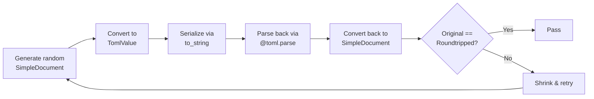
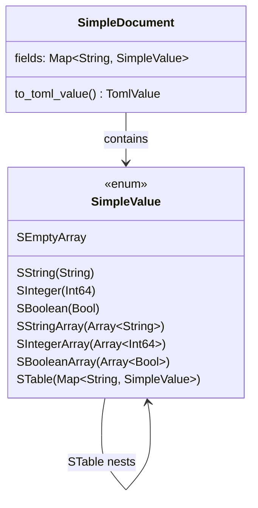
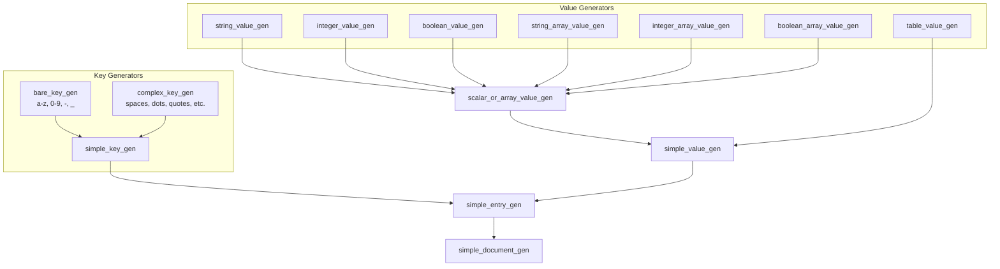

# QuickCheck Roundtrip Testing

This project uses the QuickCheck framework that ships with the MoonBit core
library (`moonbitlang/core/quickcheck`, introduced by
[moonbitlang/core#3955](https://github.com/moonbitlang/core/pull/3955)) to
verify that the TOML serializer produces output the parser can round-trip
correctly. No third-party dependency is needed.

## How It Works

The test generates random TOML documents, serializes them to strings, parses the strings back, and checks that the result matches the original.


```mermaid
flowchart LR
    A[Generate random\nSimpleDocument] --> B[Convert to\nTomlValue]
    B --> C[Serialize via\nto_string]
    C --> D[Parse back via\n@toml.parse]
    D --> E[Convert back to\nSimpleDocument]
    E --> F{Original ==\nRoundtripped?}
    F -->|Yes| G[Pass]
    F -->|No| H[Shrink & retry]
    H --> A
```

## Architecture

The test uses a **simplified document model** (`SimpleDocument` / `SimpleValue`) rather than the full `TomlValue` type. This avoids generating values that are hard to round-trip (floats, datetimes) and focuses on the structural correctness of the serializer.


```mermaid
classDiagram
    class SimpleDocument {
        fields: Map~String, SimpleValue~
        to_toml_value() TomlValue
    }
    class SimpleValue {
        <<enum>>
        SString(String)
        SInteger(Int64)
        SBoolean(Bool)
        SEmptyArray
        SStringArray(Array~String~)
        SIntegerArray(Array~Int64~)
        SBooleanArray(Array~Bool~)
        STable(Map~String, SimpleValue~)
    }
    SimpleDocument --> SimpleValue : contains
    SimpleValue --> SimpleValue : STable nests
```

## QuickCheck Components

The QuickCheck plumbing lives in the `internal/qc_model` package:

- `internal/qc_model/generator.mbt` defines the generators and the
  `Arbitrary` impl for `SimpleDocument`.
- `internal/qc_model/shrink.mbt` defines the shrinkers and the `Shrink`
  impl for `SimpleDocument`.
- `internal/qc_model/roundtrip_test.mbt` defines the round-trip property,
  drives it with `@qc.check`, and snapshots the generator's coverage.

The test implements four key pieces required by the quickcheck framework:

### 1. Generators (`@qc.Generator`)

Generators produce random values. Each type needs a custom generator.


```mermaid
flowchart TD
    subgraph "Key Generators"
        BK[bare_key_gen\na-z, 0-9, -, _] --> SK[simple_key_gen]
        CK[complex_key_gen\nspaces, dots, quotes, etc.] --> SK
    end

    subgraph "Value Generators"
        SV[string_value_gen]
        IV[integer_value_gen]
        BV[boolean_value_gen]
        SA[string_array_value_gen]
        IA[integer_array_value_gen]
        BA[boolean_array_value_gen]
        TV[table_value_gen]
    end

    SV & IV & BV & SA & IA & BA --> SOAV[scalar_or_array_value_gen]
    SOAV & TV --> SVG[simple_value_gen]
    SK & SVG --> EG[simple_entry_gen]
    EG --> DG[simple_document_gen]
```

Key generator patterns used:

| Pattern | Example | Purpose |
|---------|---------|---------|
| `spawn()` (local helper) | `(spawn() : @qc.Generator[String])` | Use the built-in Arbitrary instance |
| `@qc.one_of([...])` | `one_of([pure('-'), pure('_')])` | Choose uniformly from options |
| `@qc.frequency([...])` | `frequency([(3U, bare), (2U, complex)])` | Weighted random choice |
| `.map(fn)` | `gen.map(x => SString(x))` | Transform generated values |
| `.flat_map(fn)` | `gen.flat_map(n => ...)` | Chain dependent generators |
| `lift2(f, g1, g2)` (local helper) | `lift2(make_pair, key_gen, val_gen)` | Combine two generators |
| `.scale(fn)` | `gen.scale(s => min(s, 8))` | Control size parameter |
| `.array_with_size(n)` | `gen.array_with_size(len)` | Generate fixed-size arrays |
| `@qc.sized(fn)` | `sized(size => ...)` | Access the current size |

`char_range`, `lift2`, and `lift3` are small local helpers in
`generator.mbt`; the core package covers everything else directly.

### 2. Shrinker (`impl @shrink.Shrink for SimpleDocument`)

When a test fails, quickcheck uses shrinkers to find the **minimal** failing case. The shrinker tries:
- Removing individual entries from tables
- Shrinking individual values within entries

```moonbit
fn shrink_simple_value(value : SimpleValue) -> Iter[SimpleValue] {
  match value {
    SString(s) => @shrink.Shrink::shrink(s).map(next => SString(next))
    STable(fields) =>
      shrink_table_entries(fields.to_array()).map(next_entries => STable(
        Map::from_array(next_entries),
      ))
    // ...
  }
}
```

### 3. Property (`(SimpleDocument) -> Bool raise?`)

The property is a plain function; on failure it raises with the rendered
TOML so the counterexample text appears in the failure report:

```moonbit
(doc : @qc_model.SimpleDocument) => {
  let rendered = doc.to_toml().to_string()
  match simple_document_roundtrip_check(doc, rendered) {
    Ok(_) => true
    Err(message) => fail(message)
  }
}
```

The core driver reports the shrunk counterexample via `Debug` alongside
the raised message.

### 4. Running (`@qc.check`)

```moonbit
test "quickcheck simple document roundtrip" {
  @qc.check(roundtrip_property, count=2000, max_size=12)
}
```

`@qc.check` raises with a failure report (including the shrunk
counterexample) if the property is falsified; on success the test simply
passes.

## Coverage Snapshot

The core driver has no `classify` combinator, so structural coverage is
snapshotted separately: a fixed-seed sample of 2000 documents is tallied
against the `contains_*` predicates and the counts are checked with
`inspect`:

```
651/2000 : contains-table
1338/2000 : contains-array
519/2000 : contains-datetime-array
548/2000 : contains-fractional-datetime
855/2000 : contains-datetime
767/2000 : contains-negative-exponent-like-key
1210/2000 : contains-complex-key
1030/2000 : contains-string
```

This means ~33% of generated documents contain nested tables and ~67% contain arrays, giving good structural coverage. If a generator change shifts the distribution, the snapshot fails and the new counts must be reviewed.

## Size Control

The generators use `capped_size` to keep documents manageable:

- Keys: max 5 characters (`capped_size(size, 4)` for tail)
- Strings: max 8 characters (`.scale(fn(s) { capped_size(s, 8) })`)
- Table fields: max 4-5 entries
- Nesting: halved at each level (`size / 2`)

This prevents exponential blowup while still generating interesting structures.
